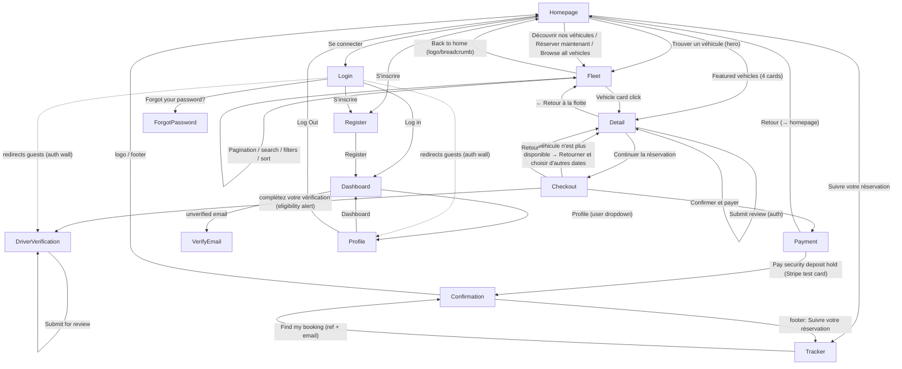

# Customer Journey Map — Car Rental Application

> Traced 2026-08-08 against the live app at `http://localhost:8099` via Playwright.
> Every link below was clicked/verified in the browser (real HTTP, real DB data), not inferred from source.
> Two navigation states are documented where relevant: **guest** (logged out) and **authenticated** (logged-in customer).

## Complete Page Flow

### Homepage (`/`)
**How to get here:** Direct URL, click "Car Rental" logo from any page.

**Clickable elements (guest state):**
- Skip link "Aller au contenu" → `#main-content` (same page, jumps to content)
- Header "Car Rental" (logo) → `/`
- Header "Notre Flotte" → `/vehicles`
- Header "Se connecter" → `/login`
- Header "S'inscrire" → `/register`
- Header "fr" / "en" toggle → same page with `?lang=fr` / `?lang=en` (verified: clicking "en" → `/?lang=en`)

**Clickable elements (authenticated state):**
- Header "Car Rental" (logo) → `/`
- Header "Notre Flotte" → `/vehicles`
- Header "Mon Compte" → `/profile`
- Header "Vérification conducteur" → `/account/driver-verification`
- Header "Se déconnecter" (button) → logs out → `/`
- Header "fr" / "en" toggle → `?lang=fr` / `?lang=en`

**Hero search bar:**
- Hero "Lieu de prise en charge" combobox (datalist of cities) → submitted with form
- Hero "Date de prise en charge" textbox → submitted with form
- Hero "Date de retour" textbox → submitted with form
- Hero "Trouver un véhicule" button → `/vehicles?location=X&pickup=Y&return=Z`
  - Verified: filled Casablanca + 2026-09-10/2026-09-15 → `/vehicles?location=Casablanca&pickup=2026-09-10&return=2026-09-15` (result list filtered to 4 vehicles)

**Featured vehicles section:**
- "Browse all vehicles →" (fr: "Voir tout le catalogue →") → `/vehicles`
- Featured vehicle cards (4 most recent available): Toyota quam → `/vehicles/31` · Peugeot 208 → `/vehicles/3` · Kia Picanto → `/vehicles/4` · Dacia Sandero → `/vehicles/2`

**CTA band:**
- "Découvrir nos véhicules" → `/vehicles`
- "Réserver maintenant" → `/vehicles`

**Footer (guest):**
- "Notre Flotte" → `/vehicles`
- "Suivre votre réservation" → `/bookings/track`
- "Se connecter" → `/login`
- "S'inscrire" → `/register`

**Footer (authenticated):**
- "Notre Flotte" → `/vehicles`
- "Suivre votre réservation" → `/bookings/track`
- "Mon Compte" → `/profile`

- 🟢 Well-connected: hero search, 4 featured vehicles, two CTAs, and footer all funnel to the fleet/detail pages. No dead-end links.

---

### Fleet Listing (`/vehicles`)
**How to get here:** Header "Notre Flotte", hero "Trouver un véhicule", any "Découvrir nos véhicules"/"Browse all vehicles"/"Réserver maintenant" CTA, footer "Notre Flotte".

**Clickable elements:**
- Breadcrumb "Home" → `/`
- Header + footer links (same set as homepage, guest or authenticated)
- Search box "Rechercher des véhicules..." → `/vehicles?search=…` (verified: `BMW` → 1 result, BMW Série 3)
- Date bar: "Date de prise en charge", "Date de retour", button "Update" → `/vehicles?pickup=Y&return=Z` (verified) — filters to vehicles available in that window; **card links then carry the dates**: `/vehicles/{id}?pickup_at=…&return_at=…`
- Filter "Category" (Tous / Economy / Luxury / SUV / Van) → `/vehicles?category=…` (verified: `Luxury` → 4 results)
- Filter "Transmission" (Tous / Automatic / Manual) → URL param
- Filter "Location" / "Ville" (14 cities incl. Agadir, Casablanca, Fes, Marrakech, Tangier…) → `/vehicles?location=…` (verified via hero search)
- Sort "Trier par" (Défaut / Price: Low to High / Price: High to Low / Name: A–Z) → `/vehicles?sort=price_asc` etc. (verified: `price_asc` reorders Kia Picanto 200 first)
- "Tout effacer" (clear all filters) button — appears only once a filter is active
- Result count line "Affichage de N véhicules" (not clickable)
- Vehicle cards (20 per page) → `/vehicles/{id}` (or `/vehicles/{id}?pickup_at=…&return_at=…` when dates are set)
- Pagination: page numbers `1` / `2` → `/vehicles?page=1` / `/vehicles?page=2`; "Next »" → `/vehicles?page=2` (verified); "« Previous" disabled on page 1

- 🟢 Well-connected: search + 4 filters + sort + date bar + pagination all work client-side → server-side and keep state in the URL. Every card links to a detail page.
- 🟡 Minor: the date-bar button is labeled "Update" (English) inside an otherwise-French page.

---

### Vehicle Detail (`/vehicles/{id}`)
**How to get here:** Click any vehicle card from the fleet listing or homepage featured grid.

**Clickable elements:**
- Breadcrumb: "Home" → `/` · "Notre Flotte" → `/vehicles`
- "← Retour à la flotte" → `/vehicles`
- Header + footer links (same storefront set)
- Gallery: single main image (`img "… — photo 1"`). No thumbnail strip or prev/next/lightbox controls observed. **Some vehicles render no image at all** (e.g. vehicle 31 Toyota quam shows an empty gallery area).
- "Inclus dans le prix" sidebar box (static list, not clickable): Assurance tous risques / Kilométrage illimité / Assistance 24/7 / Annulation gratuite
- "Réserver" box: "Date de prise en charge", "Date de retour", button "Continuer la réservation" → submits form → `/vehicles/{id}/book?pickup_at=…&return_at=…`
- Price row: "Continuer la réservation" link (same destination, with current dates); "Aucun paiement requis maintenant" note
- Reviews section: existing reviews; "Leave a review" form (**auth-gated — hidden for guests**) with Rating select, "Title (optional)", "Review", "Submit review" button
- "You might also like" (4 related vehicles) → `/vehicles/{other-id}` (verified on /vehicles/1 and /vehicles/31)

**Availability fallback (real finding):** submitting dates the vehicle is not available for lands on the checkout URL showing the error state — "Ce véhicule n'est plus disponible pour ces dates." + link "Retourner et choisir d'autres dates" → `/vehicles/{id}` (verified on Renault Clio with its default dates).

- 🟢 Well-connected: back-links (breadcrumb, retour), recommendations, and the booking form all work; detail → checkout is the primary conversion path.
- 🟡 No login/register prompt for guests next to the review form (guests just see "No reviews yet.").

---

### Checkout (`/vehicles/{id}/book?pickup_at=…&return_at=…`)
**How to get here:** "Continuer la réservation" on the vehicle detail page.

**Header/structure (both auth states):**
- "Retour" → `/vehicles/{id}`
- "Car Rental" (logo) → `/`
- Reservation stepper: `1 Véhicule · 2 Options · 3 Paiement` — display-only, **not clickable**; the "Options" step is never actually used (flow jumps 1 → 3)
- "Paiement sécurisé" badge

**Guest state:**
- "Informations personnelles" form: "Prénom", "Nom", "Email", "Téléphone" (with fixed "+212" country prefix)
- Pickup / Return summary (dates + location: Casablanca Mohammed V Airport, Casablanca)
- "Code promo": textbox + "Appliquer" button → re-submits with `&promo_code=…` in the URL; an invalid code shows inline error "This code is not valid or is inactive." (verified with `WELCOME10`)
- Price summary: vehicle, rate × days, "Assurance incluse", "Caution" (deposit), "Total" ("Taxes incluses")
- "Confirmer et payer" button → creates the booking → renders the **Payment** step (verified: guest → payment page)
- Notes: "Aucun paiement requis maintenant" · "En confirmant, vous acceptez les conditions générales"

**Authenticated state:**
- "Informations personnelles" shows "Vous êtes connecté(e) en tant que {name}" + email (guest fields hidden)
- **Driver-eligibility gate (real finding):** if the user has no `approved` DriverVerification meeting the vehicle category's minimum age, "Confirmer et payer" is blocked and an alert renders — "User #{id} is not eligible to book a '{category}' category vehicle." with a link "complétez votre vérification" → `/account/driver-verification` (verified for the economy category). All 4 categories currently require an approved verification (economy/suv/van = 21, luxury = 25), so a fresh account cannot book any category.

**Availability error state (both auth states):** if dates became unavailable — "Ce véhicule n'est plus disponible pour ces dates." + "Retourner et choisir d'autres dates" → `/vehicles/{id}`.

- 🟢 Well-connected: promo feedback, eligibility feedback, availability feedback all present; primary submit button works.
- 🟡 The step-2 "Options" of the stepper never exists as a page — cosmetic but misleading.

---

### Payment — Stripe Elements (rendered at `/vehicles/{id}/book` after confirming)
**How to get here:** "Confirmer et payer" on the checkout step. (The app renders payment on the same checkout URL — there is no `/bookings/{id}/payment` route.)

**Clickable elements:**
- Header "Retour" → `/` (**homepage — not back to checkout**)
- Header "Car Rental" (logo) → `/`
- Stepper (step 3 Paiement highlighted) + "Paiement sécurisé" badge
- Booking summary: Vehicle, Pickup, Return, "Total price", "Security deposit hold (charged now)"
- "This vehicle is reserved for you until {hold_expires_at}." notice
- Stripe Payment Element (iframe): Card number, Expiration date (MM/YY), Security code, Country (defaults to Morocco), optional "Save my information for faster checkout" (email/mobile/full name), "Secure, fast checkout with Link" toggle
- "Pay security deposit hold" button → confirms the Stripe PaymentIntent → redirects to the Booking Confirmation page (verified: created booking #20, ref `XTPP0WBMC3`, then redirected to `/bookings/20?expires=…&signature=…`)
- Stripe Developer Tools iframe ("Open Stripe Developer Tools") — test-mode tooling

**Console (test-mode only, not customer-facing):** 0 errors; 5 Stripe.js warnings (HTTP-in-test, non-activated `link` payment method, unregistered domain for Apple Pay, older Elements API). No application errors on any page.

- 🟡 "Retour" discards booking context (goes home instead of back to checkout).
- 🟢 Payment works end-to-end against real Stripe test infrastructure with a real test card.

---

### Booking Confirmation (`/bookings/{id}`)
**How to get here:** After successful payment (guest: signed URL with `?expires=…&signature=…`; registered owner: plain route, owner-gated). Also reached from the Booking Tracker.

**Clickable elements:**
- Breadcrumb: "Home" → `/`
- Header + footer (same storefront set, guest or authenticated state)
- Booking summary (not clickable): "Booking #REF" heading + "Confirmed" status badge, Vehicle, Pickup (+ location), Return (+ location), "Total price", "Security deposit"

- 🟢 The guest's signed URL genuinely loads with no session (verified) and is HMAC-protected (tampered/unsigned → 403 per prior phases).
- 🟡 No in-page CTA: no "Track another booking", "Back to fleet", or "Create an account" prompts on this page. Guest recovery relies on the email + the tracker.

---

### Booking Tracker (`/bookings/track`)
**How to get here:** Footer "Suivre votre réservation" (every storefront page). Public — no login needed.

**Clickable elements:**
- Header + footer (same storefront set)
- "Find your booking" form: "Booking reference" + "Email" fields
- "Find my booking" button → POST → redirects to the matching `/bookings/{id}?expires=…&signature=…` (verified with ref `XTPP0WBMC3` + `jean.dupont@example.com` → landed on booking #20 with a fresh signed URL)

- 🟢 Works as the only guest self-service recovery path; correctly issues a fresh signed URL so guests without the original email link can still view their booking.
- 🟡 Only reachable via the footer — not present in the main header nav.

---

### Login (`/login`) — Breeze guest layout
**How to get here:** Header "Se connecter", footer "Se connecter".

**Clickable elements:**
- "Car Rental" (logo) → `/`
- "Forgot your password?" → `/forgot-password`
- "Log in" button → authenticates; verified a bad password renders inline error "These credentials do not match our records." Post-login redirect: if the user was sent to login from a protected page (e.g. checkout), Breeze's `intended` redirect returns them there. Otherwise, the fallback `dashboard` route redirects to `/vehicles` (fleet search — the app's main action).
- "Pas encore de compte ?" / "S'inscrire" → `/register`
- "Remember me" checkbox

- 🟢 Auth-protected pages correctly bounce guests here (verified: `/profile` and `/account/driver-verification` both redirect to `/login`).

---

### Register (`/register`) — Breeze guest layout
**How to get here:** Header "S'inscrire", footer "S'inscrire", login page "S'inscrire".

**Clickable elements:**
- "Car Rental" (logo) → `/`
- Fields: Name, Email, Password, Confirm Password
- "Register" button → creates account + logs in → `/dashboard` → for unverified emails redirects to `/verify-email` (so a brand-new user immediately hits the verify-email wall)
- "Already registered?" → `/login`

---

### Forgot Password (`/forgot-password`)
**How to get here:** "Forgot your password?" on the login page.

**Clickable elements:**
- "Car Rental" (logo) → `/`
- Email field + "Email Password Reset Link" button

- 🟡 No link back to Login or Register on this page (Breeze default).

---

### Profile / Dashboard (`/profile`, `/dashboard`) — Breeze authenticated layout
**How to get here:** Header "Mon Compte" → `/profile`; sidebar "Dashboard" → `/dashboard`.

**Clickable elements (/profile):**
- Sidebar "Car Rental" (logo) → `/`
- Sidebar "Dashboard" → `/dashboard` (verified: unverified email bounces to `/verify-email`)
- User dropdown "Audit User" → reveals "Profile" → `/profile` and "Log Out" (button)
- "Recent bookings" widget (dashboard slot): shows last 5 bookings (empty state: "Your last 0 bookings." / "No bookings yet.")
- Profile Information form: "Name", "Email", "Save"; plus "Your email address is unverified." + button "Click here to re-send the verification email."
- Update Password form: "Current Password", "New Password", "Confirm Password", "Save"
- Delete Account: "Delete Account" button (Breeze destructive modal)

**Clickable elements (/dashboard):** renders only "You're logged in!" (untouched Breeze stub); sidebar links as above.

- 🟡 The authenticated layout's nav has **no** link to the storefront ("Notre Flotte") nor to "Vérification conducteur" — a logged-in user in `/profile` cannot reach the fleet or their verification status except by going back to the storefront header. Two disconnected UI worlds.

---

### Driver Verification (`/account/driver-verification`) — storefront layout, auth required
**How to get here:** Header "Vérification conducteur" (authenticated), or the eligibility-alert link on checkout. Guests are redirected to `/login` (verified).

**Clickable elements:**
- Header + footer (same storefront set, authenticated)
- Form: "License number", "License country", "Date of birth", "License document (jpg, png, or pdf)" file chooser, "Submit for review" button

- 🟢 Reachable from the header and from the checkout eligibility error — the two moments a customer needs it.

---

## Per-page flags summary

| Page | 🔴 Broken / dead-end | 🟡 Missing links | 🟢 Well-connected |
|---|---|---|---|
| Homepage | — | Contact/About/Social absent | Hero + featured + CTA + footer all funnel to fleet |
| Fleet | — | "Update" label is English in French UI | Search/filters/sort/date/pagination all server-side |
| Vehicle Detail | Vehicles w/o photo → empty gallery | No login prompt next to review form | Breadcrumb, retour, recommendations, booking form |
| Checkout | Stepper's "Options" step is decorative | — | Promo/eligibility/availability feedback all inline |
| Payment | "Retour" → `/` (home), not checkout | — | Real Stripe hold works end-to-end |
| Confirmation | — | No CTA (track / back to fleet / create account) | Signed URL works, owner+guest gated |
| Tracker | — | Only in footer, not header | Only guest recovery path; works |
| Login | — | — | Correct guest redirects + register link |
| Register | — | — | Correct login link |
| Forgot Password | — | No back-to-login link | — |
| Profile/Dashboard | — | No fleet / driver-verification links | Booking-history widget renders |
| Driver Verification | — | — | Reachable from header + checkout alert |

---

## Complete Flow Diagram (Mermaid)

---

## Identified Gaps

### P0 — Critical (blocks the core journey)
- **None found.** The full guest journey (fleet → detail → checkout → real Stripe deposit hold → confirmation → tracker) works end-to-end with zero console errors and real DB-backed data.

### P1 — High (significant friction or correctness-adjacent UX)
1. **Registered users cannot book any vehicle until an admin approves a driver verification.** All four vehicle categories (economy/suv/van = 21, luxury = 25) have a minimum age requiring an `approved` verification. A brand-new account is therefore hard-blocked at checkout with no way to complete a booking, and there's no status indicator anywhere on the storefront telling the user their verification is pending/rejected before they hit the error. (Business rule by design — but the UX offers no progressive path or awareness.)
2. **Payment page "Retour" goes to `/` (homepage) instead of back to the checkout step**, silently discarding the booking context.
3. **Incomplete localization.** Switching to English (`?lang=en`) leaves the hero H1, hero paragraph, "Trouver un véhicule" button, "Pourquoi choisir Project Atlas ?" heading, and the "Prêt pour l'aventure ?" CTA band in French. The checkout stepper stays French while the payment/confirmation content is English — pages render in mixed languages.
4. **Inconsistent translation state for the fleet CTA text** — the homepage "Browse all vehicles →" link renders in English in French mode in some sessions and as French "Voir tout le catalogue →" in others.

### P2 — Medium (polish / discoverability)
5. **Checkout stepper is misleading**: shows three steps (Véhicule / Options / Paiement) but "Options" is never a real step, and none of the steps are clickable (a user cannot jump back to step 1 from step 3).
6. **Booking confirmation has no in-page CTA** — no "Track another booking", "Back to fleet", or "Create an account"; a guest's only recovery paths are the confirmation email and the footer tracker link.
7. **Disconnected authenticated layout**: `/profile` and `/dashboard` (Breeze layout) offer no links to the storefront ("Notre Flotte") or to "Vérification conducteur", so logged-in users in their account area can't reach the fleet or their verification status.
8. **Forgot-password page has no link back to Login/Register** (Breeze default).
9. **Footer lacks contact information** (phone, email, physical address) and social links; there are no About/Contact/FAQ pages.
10. **Vehicles without photos render an empty gallery area** on the detail page (no placeholder image), e.g. vehicle 31.
11. **Guests see no login prompt next to the review form** — the "Leave a review" form is auth-gated and simply hidden for guests.
12. **Fleet date-bar button is labeled "Update" (English)** inside an otherwise-French page; the Booking Tracker is the only guest booking entry point in the footer, not the header.
13. **Stripe Payment Element emits test-mode console warnings** (non-activated `link` payment method, unregistered domain for Apple Pay, HTTP-in-test) — expected in this environment, but should be resolved (activate methods, register domain, serve HTTPS) before production.

## Updates (2026-08-08)

- **Post-login redirect**: Dashboard now redirects to `/vehicles` (fleet search) instead of the bare Breeze "You're logged in!" page. If the user was redirected to login from a protected page (e.g. checkout), Laravel's `intended` redirect returns them there automatically.
- **Homepage images**: Featured vehicle cards now show actual photos (fixed `vehicle.listQuery` filter pipeline application in the route).
- **Homepage carousel**: Featured vehicles section is now an admin-switchable layout variant (grid ↔ carousel) via the Layout Variants page.
- **UX fixes**: Search→location mapping, payment back-link, i18n completion, promo placeholder, recommendation dates, login register-link, stepper cleanup all applied.
